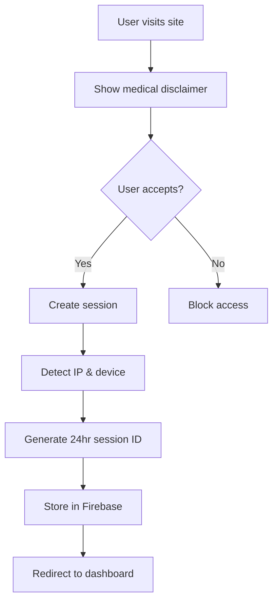

# 🐝 MediBee - AI-Powered Healthcare Assistant

> **Your intelligent medical companion for the Indian healthcare ecosystem**


## 🚀 What is MediBee?

MediBee is a cutting-edge, AI-integrated medical assistant web application designed specifically for Indian users. It combines real-time user sessions, secure data handling, medical image/prescription analysis, and intelligent health guidance using powerful LLMs like Gemini.

### 🎯 Key Features

- **Smart Session System** - IP-based 24hr sessions or permanent Google login
- **AI Prescription Analyzer** - OCR + AI analysis of Indian medicines
- **Medical Record Interpreter** - AI-powered analysis of blood reports & documents
- **Privacy-First Design** - Secure Firebase backend with user consent
- **PWA Ready** - Installable Android experience
- **Indian Healthcare Focus** - Tailored for Indian medical context

## 🛠️ Tech Stack

| Layer | Technology |
|-------|------------|
| **Frontend** | Vite + React + TypeScript + TailwindCSS + ShadCN |
| **Animation** | Framer Motion |
| **PWA** | Web App Manifest + Service Worker |
| **OCR** | Tesseract.js (Browser-based) |
| **AI Integration** | Gemini API (Text analysis & explanations) |
| **Backend** | Firebase Firestore + Auth |
| **Session Management** | IP + GeoLocation + 24hr expiry |
| **Medical Data** | WHO, MoHFW India, HealthData.gov |

## 🔐 Session & Authentication Architecture

### Access Modes

| Mode | Description | Duration | Data Storage |
|------|-------------|----------|--------------|
| **Guest Session** | IP + Geo + Device fingerprint | 24 hours | Temporary, auto-purged |
| **Google Login** | Permanent Firebase Auth | Persistent | Encrypted Firestore |

### Security Flow
```
Site Visit → Medical Disclaimer → Accept Terms → Session Creation → Feature Access
```

### Session Tracking
- Device information (browser, OS, screen)
- Geographic location (city, country)
- User interactions and page visits
- Medical searches and uploads
- AI analysis history

## 📋 Current Implementation Status

### ✅ Completed Features
- [x] Smart session management system
- [x] Firebase integration with Firestore
- [x] Google authentication
- [x] IP & device fingerprinting
- [x] Session-based routing protection
- [x] Medical disclaimer modal
- [x] PWA-ready structure
- [x] Responsive UI with dark/light themes

### 🚧 In Development
- [ ] OCR prescription analyzer (Tesseract.js)
- [ ] AI medical record interpreter (Gemini API)
- [ ] Indian medicine database integration
- [ ] Offline PWA capabilities
- [ ] Enhanced medical knowledge base

### 🔮 Planned Features
- [ ] Symptom checker AI chat
- [ ] Health metrics tracking
- [ ] Family account management
- [ ] Regional language support (Hindi, Tamil, etc.)
- [ ] Doctor consultation booking
- [ ] Pharmacy integration

## 🚀 Quick Start

### Prerequisites
- Node.js 18+ or Bun
- Firebase project with Firestore enabled
- Internet connection for real-time features

### Installation

```bash
# Clone the repository
git clone https://github.com/yourusername/medibee.git
cd medibee

# Install dependencies
npm install
# or
bun install

# Start development server
npm run dev
# or
bun dev
```

### Firebase Setup

1. Create a Firebase project at [Firebase Console](https://console.firebase.google.com/)
2. Enable Firestore Database
3. Enable Authentication with Google provider
4. Copy your Firebase config to `src/lib/firebase.ts`

### Environment Variables

Create a `.env.local` file (not tracked in git):

```env
# Firebase Configuration (get from Firebase Console)
VITE_FIREBASE_API_KEY=your_api_key_here
VITE_FIREBASE_AUTH_DOMAIN=your_auth_domain
VITE_FIREBASE_PROJECT_ID=your_project_id

# Future API Keys (when implemented)
VITE_GEMINI_API_KEY=your_gemini_key
```

## 📁 Project Structure

```
medibee/
├── src/
│   ├── components/          # Reusable UI components
│   │   ├── ui/             # ShadCN components
│   │   ├── SessionProvider.tsx
│   │   ├── SessionPopup.tsx
│   │   └── Navigation.tsx
│   ├── pages/              # Route components
│   │   ├── Index.tsx       # Landing page
│   │   ├── Dashboard.tsx   # Main dashboard
│   │   └── Analysis.tsx    # AI analysis tools
│   ├── hooks/              # Custom React hooks
│   ├── lib/                # Utilities & configurations
│   │   ├── firebase.ts     # Firebase config
│   │   ├── auth.ts        # Authentication helpers
│   │   └── utils.ts       # General utilities
│   └── App.tsx            # Main app component
├── public/
│   ├── manifest.json      # PWA manifest
│   └── service-worker.js  # PWA service worker
├── firebase.json          # Firebase hosting config
└── package.json
```

## 🔄 Session Flow Architecture

### 1. Initial Visit


### 2. Session Management
- **Session Creation**: IP + timestamp + device fingerprint
- **Session Validation**: Check expiry & Firebase existence
- **Session Extension**: User activity resets 24hr timer
- **Session Upgrade**: Convert to permanent via Google login

### 3. Data Privacy
- Guest sessions: Anonymized, auto-deleted after 24hrs
- Permanent users: Encrypted, user-controlled deletion
- Medical data: Never shared, used only for personalized insights
- AI training: Only anonymized, aggregated patterns

## 🏥 Medical Features Overview

### Prescription Analyzer
- Upload photos of medicine boxes/prescriptions
- OCR extraction of drug names, dosages, instructions
- AI analysis of interactions, side effects, alternatives
- Database of 500+ common Indian medicines

### Medical Record Interpreter
- Upload blood reports, scan results, prescriptions
- AI-powered plain-language explanations
- Health trend analysis and warnings
- Actionable health recommendations

### Knowledge Base
- WHO & MoHFW India health data
- 100+ disease profiles with symptoms
- Health FAQs in English & Hinglish
- Emergency contact information

## 🤝 Contributing

We welcome contributions from developers, medical professionals, and health enthusiasts!

### Development Setup
1. Fork the repository
2. Create a feature branch: `git checkout -b feature/amazing-feature`
3. Make your changes and test thoroughly
4. Commit: `git commit -m 'Add amazing feature'`
5. Push: `git push origin feature/amazing-feature`
6. Open a Pull Request

### Contribution Areas
- **Medical Data**: Add Indian medicine databases, regional health info
- **Translations**: Hindi, Tamil, Bengali, and other regional languages
- **OCR Accuracy**: Improve recognition for Indian pharmacy labels
- **AI Models**: Enhance medical analysis accuracy
- **UI/UX**: Better accessibility and mobile experience
- **Documentation**: Medical guides, API docs, tutorials

### Code Style
- Use TypeScript for type safety
- Follow React best practices
- Use Tailwind for styling
- Include tests for new features
- Document medical data sources

## 📜 Legal & Medical Disclaimer

### ⚠️ Important Notice
MediBee is an educational AI assistant and **NOT a replacement for professional medical advice**. Always consult qualified healthcare professionals for medical decisions.

### Medical Disclaimer
- Information provided is for educational purposes only
- Not intended for medical diagnosis or treatment
- Always verify information with licensed medical practitioners
- In emergencies, contact local emergency services immediately

### Privacy Commitment
- User data is encrypted and secure
- No medical information is shared with third parties
- Users control their data deletion
- Compliant with Indian data protection laws

## 🔗 Links & Resources

- **Live Demo**: [medibee.lovable.app](https://medibee.lovable.app)
- **Documentation**: [docs.medibee.dev](https://docs.medibee.dev) *(coming soon)*
- **API Reference**: [api.medibee.dev](https://api.medibee.dev) *(coming soon)*
- **Community Discord**: [discord.gg/medibee](https://discord.gg/medibee) *(coming soon)*

## 📄 License

This project is licensed under the MIT License - see the [LICENSE](LICENSE) file for details.

## 🙏 Acknowledgments

- **Medical Data Sources**: WHO, Ministry of Health & Family Welfare (India), HealthData.gov
- **AI Technology**: Google Gemini API
- **Open Source Libraries**: React, Firebase, Tailwind CSS, ShadCN
- **Community**: Contributors, medical professionals, and users who help improve healthcare accessibility

---

**Built with ❤️ for Indian healthcare accessibility**

*Making medical information understandable for everyone, everywhere.*
